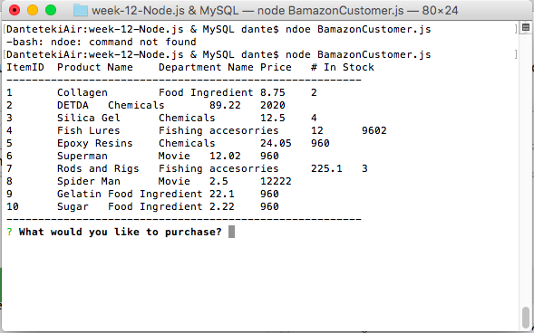
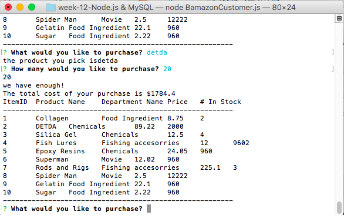
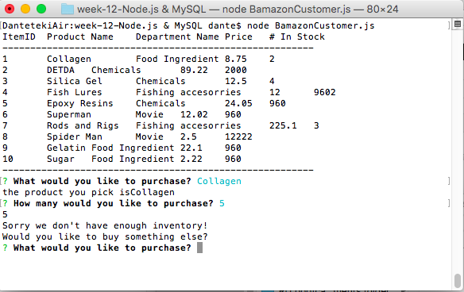
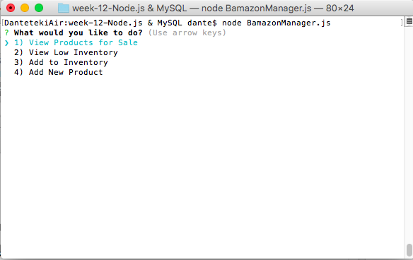
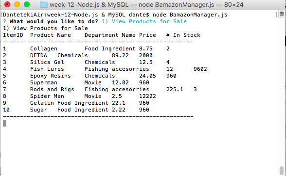
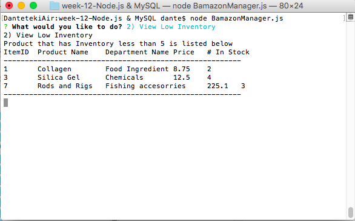
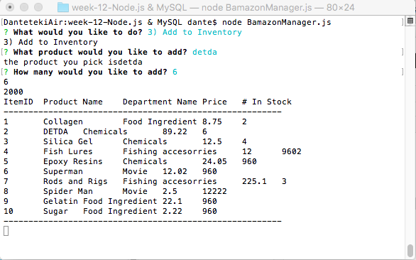
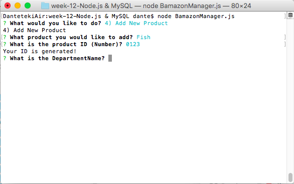
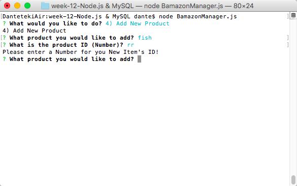
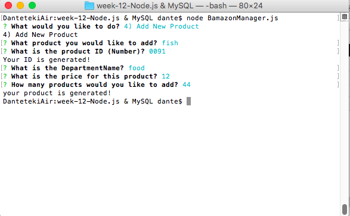

# Bamazon
<h3> Welcome to the Bamazon instruction file! </h3>

The instructions below will cover both Customer and Manger version of Bamazon node system

<h5>First, Bamazon Customer</h5>

  1. Table is shown along with a prompt asking the customer what would you like to buy? 
   
  
   
  2. After user input the name of the product and the volume, the window will show whether we have enough inventory, if yes, the total charge will be calculated and the buying volume will be subtracted from the table database. Shown as below image.
  
    
  3. If there is not enough inventory, it will show below:
    
  

  

<h5>Second, Bamazon Manager</h5>

  1. Table is shown along with a prompt giving the manager four options, shown as below: 
   
  
   
  2. If manger choose option 1, it will list all of the products available for sale, shown as below:
  
    
  3. If manger choose option 2, it will list all items for which the quantity available in stores is less than 5
   
  
   
  4. If manger choose option 3, it will provide the manager with the ability to "add more" of any item currently in the store. First it will ask what product do you want to add. Then it will ask how many you want to add for this item. Then the talbe will be populated with the updated volume for this item. Shown as below:
   
  
   
  5. If manger choose option 4, it will provide the manager with the ability to add a completely new product to the store. First it will ask what product do you want to add. Then it will ask for an product ID for this item, the ID can only be a Number, if a number is given it will show as below:
   
  
   
  If the user type in something that is not a number, it will show below and ask the user to enter the new item again. 
    
   
  After the ID is generated, the user can follow the prompt to finish the new product input, after it is done, the prodcut will be generated! Like below:

    
   

